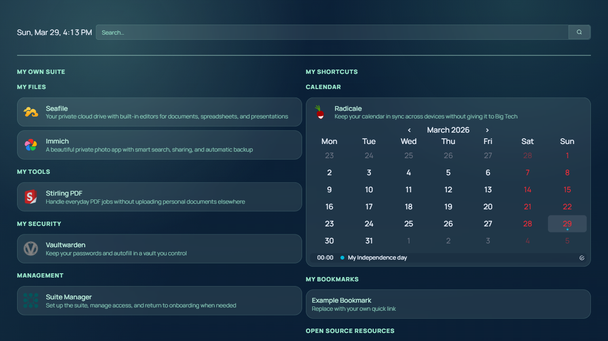
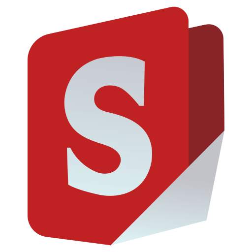
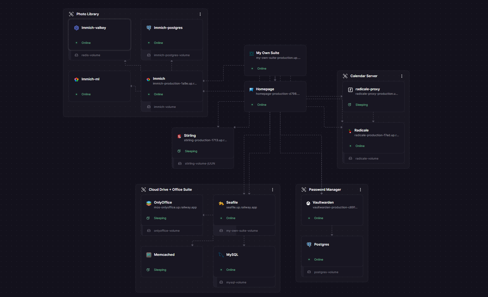

<p align="center">
  
</p>
<h1 align="center">My Own Suite</h1>
<p align="center"><sub>Your Big Tech exit kit.</sub></p>
<p align="center">
  <a href="https://myownsuite.org/"></a>
  <a href="https://myownsuite.org/docs"></a>
</p>

My Own Suite packages proven self-hosted apps into one setup with a guided first-run flow, a shared dashboard, and deployment paths that let people start simple and move toward more independence over time.

Today the repository is centered on a documented Docker Compose stack, a maintained VPS/local path, and a Railway template path for the easiest hosted start.



## What You Get

- A private cloud you control instead of a consumer SaaS ecosystem that controls you
- A guided Suite Manager onboarding flow instead of a pile of disconnected containers
- A Homepage dashboard that makes the suite feel like one product
- Curated open-source apps for files, office work, photos, passwords, calendars, and PDFs
- Multiple deployment paths so you can start with convenience and move toward more ownership later

## Included Modules

| Solution | App | Alternative to |
| --- | --- | --- |
| Dashboard |  **Homepage** | Link hubs, bookmarks |
| Cloud Storage |  **Seafile** | Google Drive, Dropbox, OneDrive |
| Office Suite |  **ONLYOFFICE** | Google Docs, Microsoft 365 |
| Photo Library |  **Immich** | Google Photos, iCloud Photos |
| Calendar Sync |  **Radicale** | Google Calendar, iCloud, Outlook |
| PDF Tools |  **Stirling PDF** | Adobe Acrobat, Smallpdf |
| Password Manager |  **Vaultwarden** | 1Password, LastPass, Bitwarden cloud |
| Control Plane |  **Suite Manager** | Guided onboarding, login, and shared entrypoint for the suite |

## Why It Exists

Most people stay inside Google, Apple, and Microsoft because those tools are convenient, connected, and available everywhere. My Own Suite is built for people who want that same kind of everyday usefulness without handing over the app layer, the ecosystem, and the long-term ownership boundary.

This project is for:

- individuals and families who want a more private cloud setup
- freelancers and creators who do not want their work folded into platform lock-in
- people who want open-source alternatives without assembling the whole stack by hand
- technical users who want a cleaner starting point for a self-hosted personal cloud

## Choose A Deploy Path

The public docs are organized around three ways to get started:

- [Deploy on Railway](https://myownsuite.org/docs/deploy-on-railway): the easiest hosted starting point
- [Deploy on a VPS](https://myownsuite.org/docs/deploy-on-vps): the current maintained self-managed path in this repo
- [Deploy on your own hardware](https://myownsuite.org/docs/deploy-on-your-own-hardware): the most independent path, still earlier in maturity



If you are new to the project and want the smoothest first experience, start with [How to get started](https://myownsuite.org/docs/getting-started).

## Quick Start (Local VPS Stack)

If you want to run the current repo-managed Docker Compose stack locally or on a VPS:

```bash
git clone https://github.com/rpuls/my-own-suite.git
cd my-own-suite
npm run vps:init
```

`vps:init` now auto-generates required secrets from template expressions in `*.env.template`.
You can still customize values in `deploy/vps/**/*.env` before startup.

Then validate and start:

```bash
npm run vps:doctor
npm run vps:up
```

If you need a full destructive reset (removes volumes and data):

```bash
npm run vps:rebuild
```

After startup, open `http://suite-manager.localhost/setup/` and continue through the guided onboarding flow.

For the exact operational details, use [deploy/vps/README.md](./deploy/vps/README.md) as the canonical technical guide for the VPS/local stack.

## Validation

The repo includes black-box Playwright coverage that boots the real stack, walks the live onboarding flow, and verifies app reachability through Homepage.

Common commands:

- `npm run e2e:install`
- `npm run e2e:onboarding`
- `npm run e2e:apps`
- `npm run e2e:full`

## E2E Testing

The repo includes real black-box Playwright tests that boot an isolated Docker stack, exercise the live browser flows, and tear the stack down again after the run.

```bash
npm run e2e:install
```

Install the Playwright test dependencies and Chromium browser once on your machine.

Command overview:

- `npm run e2e:onboarding` verifies the first-run onboarding flow itself.
- `npm run e2e:apps` verifies the suite after onboarding, focusing on Homepage-driven app access and app reachability.
- `npm run e2e:full` runs both in one E2E stack lifecycle: onboarding first, then app verification.
- `npm run e2e:onboarding:manual` completes onboarding and then leaves the browser open on Homepage for manual testing.

```bash
npm run e2e:full
npm run e2e:full:headed
```

Run the full E2E suite. This starts the isolated test stack once, runs the onboarding spec, then runs the app verification spec against that same stack. Use `e2e:full` for headless CI-style verification or `e2e:full:headed` when you want to watch the whole flow in the browser.

```bash
npm run e2e:onboarding
npm run e2e:onboarding:headed
npm run e2e:onboarding:manual
```

Run just the onboarding flow. Use `:headed` when you want to watch the browser step through account creation, credential import, and Homepage handoff. Use `:manual` when you want the flow to finish and then leave the browser open on Homepage for hands-on testing.

```bash
npm run e2e:apps
npm run e2e:apps:headed
```

Run the post-onboarding app verification flow. This focuses on Homepage-driven app checks for Suite Manager, Vaultwarden, Seafile, Stirling PDF, Immich, and Radicale. When needed, the helper will first bring the suite into a usable post-onboarding state before asserting the app surfaces.

For the more detailed harness notes, see [tests/e2e/README.md](./tests/e2e/README.md).

## Documentation Map

| Need | Go here |
| --- | --- |
| Product story + public docs | [myownsuite.org](https://myownsuite.org/) |
| Getting started guide | [Docs home](https://myownsuite.org/docs) |
| Deployment overview | [site/src/content/docs/getting-started.mdx](./site/src/content/docs/getting-started.mdx) |
| Canonical VPS architecture + app onboarding steps | [deploy/vps/README.md](./deploy/vps/README.md) |
| App code + app-level technical READMEs | `apps/` |
| Deployment stacks | `deploy/` |
| Homepage service details | [apps/homepage/README.md](./apps/homepage/README.md) |
| Suite Manager service details | [apps/suite-manager/README.md](./apps/suite-manager/README.md) |
| Seafile service details | [apps/seafile/README.md](./apps/seafile/README.md) |
| ONLYOFFICE service details | [apps/onlyoffice/README.md](./apps/onlyoffice/README.md) |
| Immich service details | [apps/immich/README.md](./apps/immich/README.md) |
| Radicale service details | [apps/radicale/README.md](./apps/radicale/README.md) |
| Stirling PDF service details | [apps/stirling-pdf/README.md](./apps/stirling-pdf/README.md) |
| Vaultwarden service details | [apps/vaultwarden/README.md](./apps/vaultwarden/README.md) |
| Standalone SMTP relay utility | [apps/mail-relay/README.md](./apps/mail-relay/README.md) |

## Contributor Note

For app integration work (especially "add a new app"), treat [deploy/vps/README.md](./deploy/vps/README.md) as the canonical step-by-step architecture guide.

For day-to-day prototyping, use `staging` as the integration branch and reserve `main` for stable release-ready batches.
