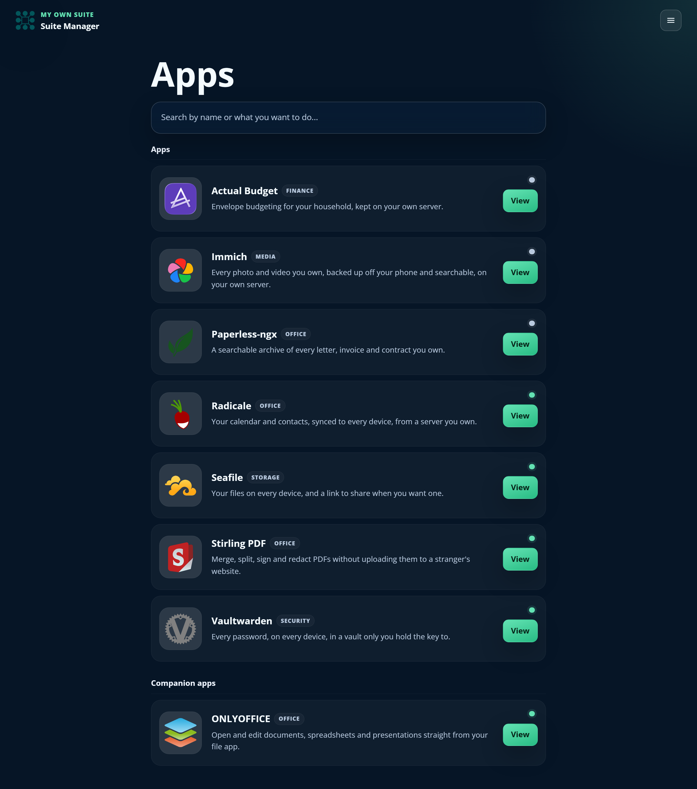

<div align="center">


# My Own Suite

**Your own private cloud — passwords, photos, files, and calendars on hardware you control.**

[Website](https://myownsuite.org) · [Get started](https://myownsuite.org/docs/getting-started/) · [Documentation](https://myownsuite.org/docs/) · [Changelog](./CHANGELOG.md)

[](./LICENSE)

</div>

---

My Own Suite (MOS) turns one machine — a mini-PC at home or a small rented cloud server — into a private replacement for the everyday cloud: install it once, then add the open-source apps you want from a curated catalog in a couple of clicks. MOS handles the databases, networking, HTTPS, and secure wiring in the background; you get one owner UI and apps that just work, with your data staying on hardware you control.

<div align="center">
  
</div>

## Why it's different

- **Privacy you can check, not marketing.** Every catalog app is assessed before it enters the catalog and carries an A-to-D privacy posture grade — telemetry, external services, accounts, data processing, and policies, each with published evidence. [How assessments work](https://myownsuite.org/docs/privacy/how-we-assess/).
- **A signed catalog and pinned packages.** Apps build from digest-pinned recipes; your server verifies what it installs, and updates show you what changes — including privacy changes — before you apply them.
- **One-button backups with verified restore.** Whole-suite backups to storage you control, checked for integrity before they're ever restored.
- **Apps that plug into each other.** Connect Seafile to ONLYOFFICE and documents open for editing in the browser — MOS exchanges the secrets and wires the network.
- **Not a walled garden.** Paste any GitHub repository URL and MOS previews what the package asks for before anything installs. External apps stay labelled unverified and run restricted — and publishers can make their own apps MOS-installable with the [public packaging workflow](./skills/add-mos-app/SKILL.md).

## Install

On a fresh Ubuntu 24.04 server (your provider's browser console or SSH):

```bash
curl -fsSL https://get.myownsuite.org | sudo bash
```

Or flash the USB installer for a dedicated machine at home. The [getting-started guide](https://myownsuite.org/docs/getting-started/) walks through both paths.

**Status:** early beta. The platform is under active development and tested end-to-end, but expect rough edges and breaking releases while pre-1.0.

---

## Repository map

This repository is the whole platform — control plane, app packages, installers, docs site, and the review workflows behind the privacy assessments.

| Path | Purpose |
| --- | --- |
| `suite-manager/` | MOS web UI, backend API, owner setup, app catalog, settings, backups, and updates. |
| `apps/` | Self-contained MOS app packages with manifests, Dockerfiles, icons, setup guides, and technical notes. |
| `system-agents/` | Narrow host-owned agents for app runtime, Homepage, HTTPS, backups, updates, and lab reset. |
| `infrastructure/` | Shared runtime substrate for Caddy, Homepage defaults, installer support, and control-plane contracts. |
| `scripts/` | MOS installer renderers, smoke harnesses, reconciliation, branding sync, and developer commands. |
| `skills/` | Public, versioned workflows for adding apps, updating apps, and assessing app privacy. |
| `shared/` | Cross-process contracts used by Suite Manager and host agents. |
| `test/` | Deterministic unit tests and browser/E2E harnesses. |
| `site/` | MOS public landing page and end-user documentation source; deployed to Cloudflare Pages from `main` and `staging` via GitHub Actions. |
| `site-mos1-reference/` | Isolated previous-site source retained only as frozen rollback/reference material; not built or deployed. |

## Local development

Install dependencies, build the Suite Manager frontend, and run the local control plane:

```bash
npm install
npm run hooks:install
npm run dev
```

`npm run hooks:install` wires the local git hooks in `.githooks/` that block direct commits/pushes on `main`.

Open `http://home.localhost:3100/suite-manager/`.

Useful deterministic commands:

```bash
npm test
npm run typecheck
npm run build:client
npm run install:render -- --target json
npm run release:check
npm run build   # currently configured deployment build; see the cutover checklist
```

Browser and infrastructure smoke commands are intentionally human-run because they are noisy or can create paid/destructive resources. See [scripts/README.md](./scripts/README.md) and [test/README.md](./test/README.md).

## Documentation map

| Need | Go here |
| --- | --- |
| Documentation ownership | [docs/README.md](./docs/README.md) |
| Architecture decisions | [docs/decisions.md](./docs/decisions.md) |
| Release process | [RELEASING.md](./RELEASING.md) |
| Release notes | [CHANGELOG.md](./CHANGELOG.md) |
| Suite Manager technical notes | [suite-manager/README.md](./suite-manager/README.md) |
| App package technical notes | `apps/<app>/README.md` |
| App review workflows | [skills/README.md](./skills/README.md) |
| Host-agent notes | [system-agents/README.md](./system-agents/README.md) |
| Operator/developer scripts | [scripts/README.md](./scripts/README.md) |
| Test harness notes | [test/README.md](./test/README.md) |

For day-to-day prototyping, use `staging` as the integration branch and reserve `main` for stable release-ready batches. Agent and contributor workflow rules live in [AGENTS.md](./AGENTS.md).

## License

My Own Suite is free and open-source software licensed under the [GNU Affero General Public License v3.0 only](./LICENSE). You may use, modify, distribute, and commercially host it under the license terms; modified versions offered over a network must offer their corresponding source code to their users.

The My Own Suite, MOS, and Funkyton names and logos are not granted for use as the identity of a modified distribution or competing service. Third-party application names, logos, screenshots, and other assets remain the property of their respective owners.
