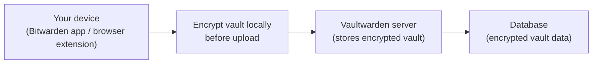
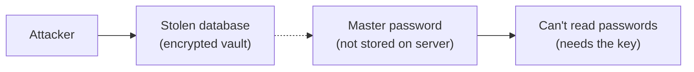

import * as TechSpecs from '../../../../../apps/vaultwarden/README.md';

Vaultwarden is a lightweight, self-hosted server that lets you use the Bitwarden apps (mobile, desktop, browser extension, and web vault) with your own private backend.

## UX that actually feels great

If a password manager feels clunky, you stop using it. Vaultwarden avoids that by using the Bitwarden client apps you already know.

- Autofill in your browser and on your phone.
- Save logins, secure notes, cards, and identities.
- Sync across iOS, Android, desktop apps, and browser extensions.
- Share safely with family/team members using shared vault features (organizations/collections).
- Use modern login protection like 2FA, hardware keys, and passkeys (client-side).

## Security - how safe is this setup?

When people hear "self-hosted password manager", the first question is usually:

> "Is this actually safe?"

The short answer: **yes** - if you follow a few simple rules.

This setup uses end-to-end encryption. That means your vault is encrypted on your own device before it is sent to the server. The server only stores scrambled data that looks like random noise.

Think of it like storing a locked safe in a warehouse:

- Your master password is the key to the safe.
- The server only stores the locked safe.
- Without the key, the safe cannot be opened.

Even if someone steals the database from the server, they only get encrypted vaults. Without your master password, those vaults are essentially useless.

### Why self-hosting can actually be safer

Large password-manager companies are attractive targets because breaking into one system could expose millions of users at once.

A privately hosted vault is different. An attacker would have to:

1. Discover your specific server
2. Successfully break into it
3. Steal the encrypted vault database
4. Crack your master password

For a single vault, that effort is rarely worth it. Decentralization reduces the reward for attackers, which lowers the likelihood of being targeted.

### What protects your passwords

Several layers of security protect your vault:

1. Strong encryption: your vault is encrypted before it leaves your device.
2. Master password protection: only your master password can unlock the vault.
3. Optional hardware keys / passkeys: you can require stronger login protection.
4. HTTPS encryption: communication between your device and server is encrypted.
5. Server isolation: the database stores encrypted vaults, not readable passwords.

Together these layers make unauthorized access extremely difficult.

### Mistakes to avoid

Most security failures come from simple mistakes. Avoid these and your vault will remain extremely secure:

- Weak master password: use a long passphrase made of several random words.
  - Example: `forest-coffee-sunlight-train-mountain`
  - Length matters more than complexity.
- Reusing your master password anywhere else: your master password must be unique.
- Not enabling two-factor authentication: hardware keys/passkeys add a powerful second layer.
- Leaving software unmaintained: keep your server and containers updated occasionally.
- Not making backups: if the database is lost, your vault is lost too.

### The biggest real risk

The biggest realistic risk is malware on your own computer or phone. If your device is infected while your vault is unlocked, malicious software could potentially read your data. This is true for every password manager, not just self-hosted ones.

### Final note

No system can guarantee absolute security. This is a strong and widely used architecture, but you are ultimately responsible for your own security: use a strong master password, enable additional protections, and keep your system maintained.

## Responsibility and liability

- Vaultwarden is a community project and is not an official Bitwarden product.
- My Own Suite provides deployment automation "as is", with no warranties or guarantees.
- You are responsible for your own security decisions, backups, and maintenance.
- To the extent permitted by law, we are not liable for lost data, account compromise, or any damages resulting from using this stack.
- This section is informational and not legal advice.

### References

  <TechSpecs.Content />

## Links

- [Vaultwarden repository](https://github.com/dani-garcia/vaultwarden)
- [Bitwarden help: Managing items](https://bitwarden.com/help/managing-items/)
